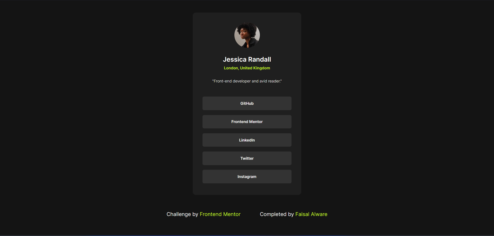

# Frontend Mentor - Social links profile solution

This is a solution to the [Social links profile challenge on Frontend Mentor](https://www.frontendmentor.io/challenges/social-links-profile-UG32l9m6dQ). Frontend Mentor challenges help you improve your coding skills by building realistic projects. 

## Table of contents

- [Overview](#overview)
  - [The challenge](#the-challenge)
  - [Screenshot](#screenshot)
  - [Links](#links)
- [My process](#my-process)
  - [Built with](#built-with)
  - [What I learned](#what-i-learned)
  - [Continued development](#continued-development)
  - [Useful resources](#useful-resources)
- [Author](#author)

## Overview

### The challenge

Users should be able to:

- See exact replica of social link profile design provided in template.
- See responsive layout of design on mobile viewports.
- See hover effect on social links as per design requirement.
- See challenge by and completed by links in footer.

### Screenshot



### Links

- Solution URL: [https://www.frontendmentor.io/solutions/responsive-social-profile-card-using-html-css-and-bootstrap-3HSqJp2u_k](https://www.frontendmentor.io/solutions/responsive-social-profile-card-using-html-css-and-bootstrap-3HSqJp2u_k)
- Live Site URL: [https://faisalalware.github.io/social-links-profile/](https://faisalalware.github.io/social-links-profile/)

## My process

### Built with

- Semantic HTML5 markup
- CSS custom properties
- Flexbox
- Bootstrap Framework
- Mobile-first workflow

### What I learned

This challenge helped me to refresh my HTML, CSS & Bootstrap skills. I've learned using variable in CSS.

To see how i learned variable in css, see below:

```css
/* used root selector to store color codes in variables */
:root{
    --primary-text-color:#ffffff;
    --secondary-text-color:#f7f7f7;
}

/* used color codes stored in variable to apply on h1 & p tag, 
rather than applying direct color codes to h1 & p tag css */
.wrapper-content h1 {
    font-size: 20px;
    font-weight: 600;
    color: var(--primary-text-color); 
} 

.wrapper-content p {
    font-size: 12px;
    font-weight: lighter;
    color: var(--secondary-text-color);
}
```
### Continued development

I've completed this challenge using HTML, CSS & Bootstrap which is basic, but in future my target is to learn JS, ReactJS and other technologies required to become a good frontend developer.  

### Useful resources

- [W3Schools](https://www.w3schools.com/) - This is an amazing article which helped me finally understand frontend concepts. I'd recommend it to anyone still learning this concept.

## Author

- LinkedIn - [Faisal Alware](https://www.linkedin.com/in/faisal-alware-048763b8/)
- Frontend Mentor - [@faisalalware](https://www.frontendmentor.io/profile/faisalalware)
- Github - [@faisalalware](https://www.twitter.com/yourusername)

